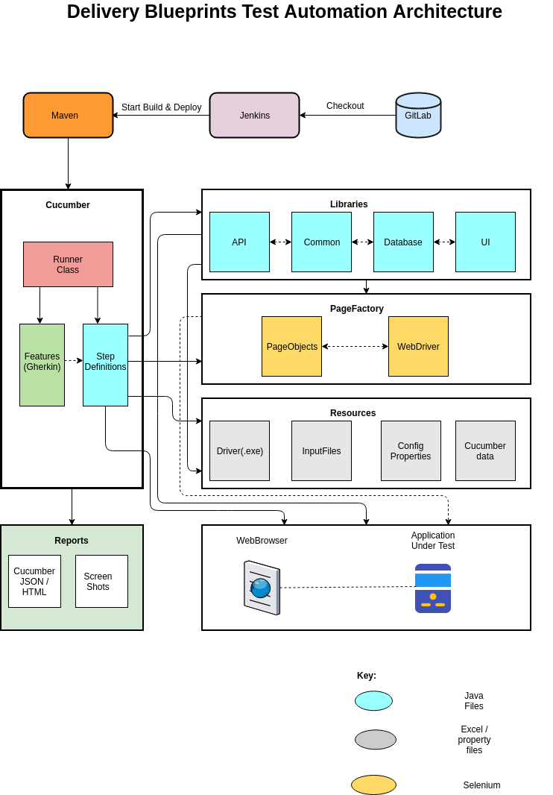

###DB Regression Test Suite:

##Set Up:
Do the following steps to set up the code to run locally:

1) Install Java 11 locally
2) Install maven
3) Clone the below git repository:
https://github.com/sramkuma9/dbRegressionTestAutomationSuite.git
4) Run a mvn clean install for the above cloned repo in turn. This will install them into your local maven repository.

##Running:
From the command line after moving into the same directory as the pom.xml do
mvn clean install

##Automation Framework Flow diagram: 

